<div align="center">

<!-- HEADER BANNER -->
<a href="https://github.com/Kreesten-hsh">
  
</a>

<br/><br/>

<!-- TERMINAL TYPING ANIMATION -->
<a href="https://github.com/Kreesten-hsh">
  
</a>

<br/><br/>

<!-- CONTACT & IDENTITY BADGES -->
<a href="https://github.com/Kreesten-hsh">
  
</a>
<a href="mailto:akreesten@gmail.com">
  
</a>
<a href="https://www.linkedin.com/in/kreesten-agboton-4817a1382/">
  
</a>


</div>

---

### ⚡ `$ whoami --identity`

```yaml
Operator: "Kreesten Eddy Agboton"
Handle: "@Kreesten-hsh"
Focus: "Full-Stack Development (Web & Mobile), Defensive Cybersecurity & Applied AI"
Academic_Background: "BSc in Computer Science & Software Engineering (HECM Cotonou)"
Goal: "Seeking International Engineering Internships & Collaborative Research"

Core_Competencies:
  - Detection_Engineering: "Automated Tier-2/3 SOC alert triage & causal IOC correlation"
  - Fraud_Mitigation: "Mobile scam analysis, SMS phishing classification & evidence packaging"
  - Cross_Platform_Mobile: "Flutter (Dart) & React Native (CLI, TypeScript) applications"
  - Backend_Engineering: "Asynchronous APIs, rate-limiting, authentication & database design"

Environment_and_Stack:
  Operating_Systems: "Debian / Linux Mint / Kali Linux"
  Primary_Languages: ["Python 3.11+", "TypeScript", "JavaScript", "Dart", "PHP"]
  Frameworks_and_Tools: ["FastAPI", "React 19", "Flutter", "React Native", "Laravel", "Docker", "PostgreSQL", "Redis"]
  Design_Principles: "Clean Architecture, Deterministic Pipelines, Least Privilege, Zero Trust"
```

---

### 🔬 Highlighted Projects

<table>
  <tr>
    <td width="50%" valign="top">
      <h4>🛡️ <a href="https://github.com/Kreesten-hsh/SentinelSOC">SentinelSOC</a></h4>
      <p><b>Tier-2/3 SOC Alert Triage & Incident Investigation Engine</b></p>
      <p>Consumes raw security telemetry (SIEM/IDS/EDR), extracts IOCs, queries multi-source logs (Fortinet, Sysmon EID 1, Suricata, Windows Events), and reconstructs the causal attack sequence with deterministic severity scoring.</p>
      <p>
        
        
        
        
      </p>
    </td>
    <td width="50%" valign="top">
      <h4>🇧🇯 <a href="https://github.com/Kreesten-hsh/BENIN-CYBER-SHIELD">BENIN CYBER SHIELD</a></h4>
      <p><b>Cross-Surface Mobile Fraud Detection & Triage Platform</b></p>
      <p>Integrated cybersecurity platform unifying a citizen verification portal, a national supervision dashboard, an SME brand defense console, and an Android Flutter passive notification listener.</p>
      <p>
        
        
        
        
      </p>
    </td>
  </tr>
  <tr>
    <td width="50%" valign="top">
      <h4>🔑 <a href="https://github.com/Kreesten-hsh/keyed">keyed</a></h4>
      <p><b>In-Process FastAPI API Key Authentication & Rate Limiting</b></p>
      <p>Lightweight authentication library storing only salted hashes in PostgreSQL. Enforces scopes, instantaneous revocation, and sliding-window rate limits without external cloud proxies.</p>
      <p>
        
        
        
        
      </p>
    </td>
    <td width="50%" valign="top">
      <h4>💎 <a href="https://github.com/Kreesten-hsh/CotonouGemsAPP">Cotonou Gems</a></h4>
      <p><b>Mobile Urban Discovery & Recommendation App (Flutter)</b></p>
      <p>Full-stack mobile application featuring dynamic discovery feeds, ambiance-based search, offline caching, and responsive UI architecture built with Flutter, Express.js, and MongoDB.</p>
      <p>
        
        
        
        
      </p>
    </td>
  </tr>
  <tr>
    <td width="50%" valign="top">
      <h4>🛡️ <a href="https://github.com/Kreesten-hsh/AdShield">AdShield</a></h4>
      <p><b>Local VPN Loopback & Network Telemetry Filter</b></p>
      <p>Cross-platform mobile application utilizing React Native CLI and TypeScript to intercept malicious tracker domains and telemetry requests locally on Android and iOS devices.</p>
      <p>
        
        
        
      </p>
    </td>
    <td width="50%" valign="top">
      <h4>🏢 <a href="https://github.com/Kreesten-hsh/Suztech">Suztech Platform</a></h4>
      <p><b>Modern Monolith for Digital Services & Administration</b></p>
      <p>Production web platform coupling Laravel 12, Inertia.js v2, and React 18 with role-based access control, responsive interfaces, and containerized Docker runtime.</p>
      <p>
        
        
        
        
      </p>
    </td>
  </tr>
</table>

---

### 🛠️ Technical Capabilities Matrix

```
┌── [ BACKEND & TELEMETRY ] ────────────────────────────────────────────────────────┐
│  • Python (FastAPI, Pytest, Pydantic, SQLAlchemy) • Multi-Source Log Parsing       │
│  • Causal Correlation & Incident Triage Engines   • SQL (PostgreSQL, SQLite, MySQL)│
│  • Redis Caching & Asynchronous Task Queues       • Reverse Proxying & Nginx       │
└───────────────────────────────────────────────────────────────────────────────────┘

┌── [ MOBILE & FRONTEND ] ──────────────────────────────────────────────────────────┐
│  • Flutter & Dart (Cross-Platform Mobile Dev)     • React 19 / TypeScript / Vite   │
│  • React Native CLI (Local Loopback Filtering)    • Inertia.js & Laravel Ecosystem │
│  • State Management (Provider, Context, Hooks)    • Responsive UI / CSS Architecture│
└───────────────────────────────────────────────────────────────────────────────────┘

┌── [ INFRASTRUCTURE & SECURITY ] ──────────────────────────────────────────────────┐
│  • Linux Environment (Debian, Mint, Hardening)    • Docker & Multi-Container Stacks│
│  • OWASP Top 10 (Web Security & Threat Models)    • Git Workflows & Automated Tests│
│  • Zero Trust Architecture & Principle of Least Privilege                          │
└───────────────────────────────────────────────────────────────────────────────────┘
```

---

### 📊 Activity & Contributions

<div align="center">

<!-- GITHUB CONTRIBUTION SNAKE ANIMATION -->
<picture>
  <source media="(prefers-color-scheme: dark)" srcset="https://raw.githubusercontent.com/Kreesten-hsh/Kreesten-hsh/output/github-contribution-grid-snake-dark.svg">
  <source media="(prefers-color-scheme: light)" srcset="https://raw.githubusercontent.com/Kreesten-hsh/Kreesten-hsh/output/github-contribution-grid-snake.svg">
  
</picture>

</div>

---

<div align="center">
  
  <br/>
  <sub>© <b>Kreesten Eddy Agboton</b> • Software & Cybersecurity Portfolio</sub>
</div>
